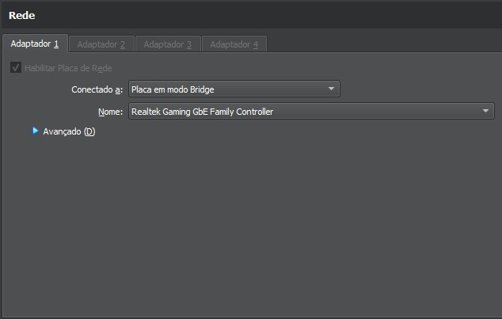
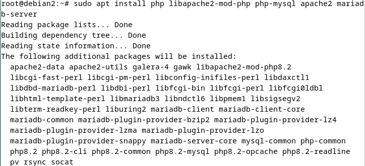
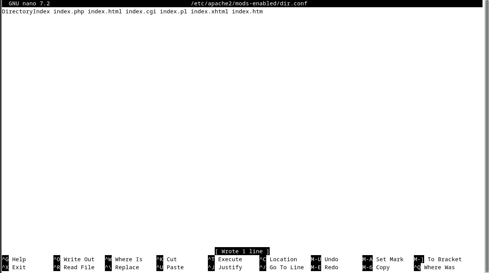
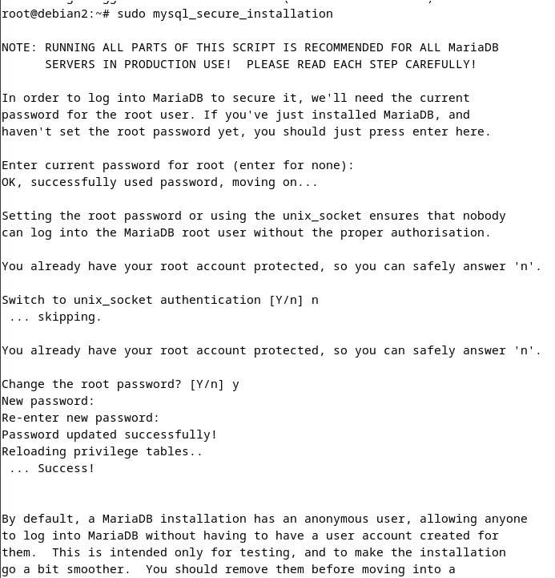
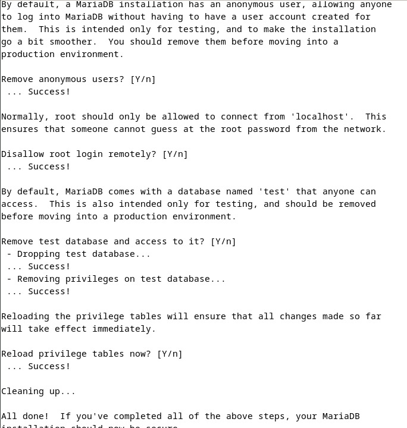
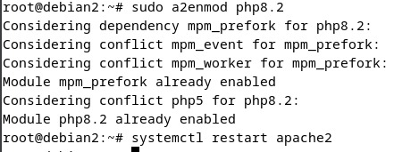

# Configuração Inicial da Máquina Linux

## Ajustando o Adaptador de Rede

Para acessar o IP da máquina Linux no navegador do Windows, é necessário colocar o adaptador 1 em modo bridge.

## Instalando Pacotes Necessários

Execute os seguintes comandos para instalar o Apache, PHP, e MariaDB:

sudo apt install php libapache2-mod-php php-mysql apache2 mariadb-server

# Ajustes no Apache

## Configurando o Apache para Priorizar o index.php

Edite o arquivo de configuração do Apache para garantir que o index.php seja carregado primeiro:

sudo nano /etc/apache2/mods-enabled/dir.conf

Fazer o comando sudo mysql_secure_installation para completar a instalação do mariadb.

Após completar a instalação do mariadb, ativar o php:
