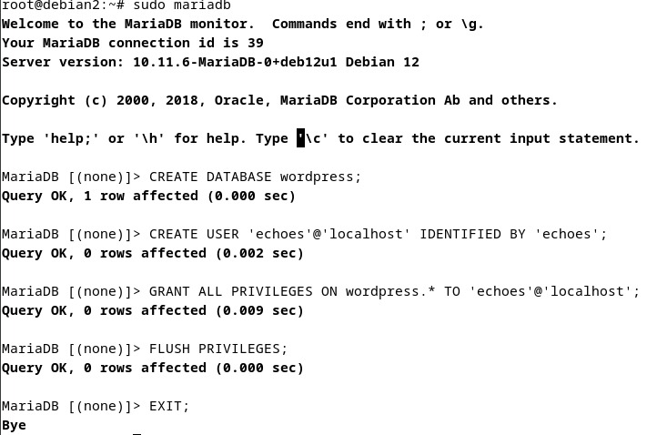

# Configuração do Banco de Dados

## Configurando MariaDB

Inicie o MariaDB e crie o banco de dados e o usuário para o WordPress:

``` bash
sudo mariadb

CREATE DATABASE wordpress;

CREATE USER 'echoes'@'localhost' IDENTIFIED BY 'echoes';

GRANT ALL PRIVILEGES ON wordpress.* TO 'echoes'@'localhost';

FLUSH PRIVILEGES;

EXIT;
```

