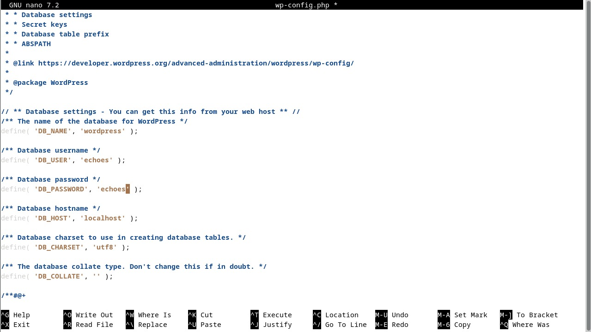

# Instalando o WordPress

O [WordPress](https://wordpress.org) é um sistema de gerenciamento de conteúdo (CMS) popular e amplamente utilizado para criar e gerenciar sites e blogs. Ele é conhecido por sua flexibilidade, extensibilidade e uma vasta gama de temas e plugins que permitem personalizar seu site de acordo com suas necessidades.

## Baixando e Extraindo o WordPress

Faça o download e extraia o WordPress no diretório do servidor web:

```bash
cd /tmp
curl -O https://wordpress.org/latest.tar.gz
tar xzvf latest.tar.gz
```


Após baixar e extrair o WordPress para o diretório /tmp, você deve mover os arquivos para o diretório do servidor web e configurar as permissões necessárias.

```bash
sudo cp -a /tmp/wordpress/. /var/www/html
sudo chown -R www-data:www-data /var/www/html
sudo chmod -R 755 /var/www/html
cd /var/www/html
sudo mv wp-config-sample.php wp-config.php
sudo nano wp-config.php
```


Depois de mover os arquivos para o diretório do servidor web, fazer as alterações usando os dados criados no mariadb no wp-config:


## Iniciando o WordPress no navegador
Depois de configurar, acessar o ip da máquina no navegador do linux, para acessar o WordPress. Vai abrir a configuração inicial do wordpress:


Após a configuração inicial, agora é preciso colocar a URL personalizada para o WordPress.

Passo a passo:

* Acessar o wp-admin do WordPress
* Ir em configurações no menu lateral
* Colocar o URL personalizado em Endereço do WordPress e Endereço do site
  


Além de colocar o URL nas configurações do WordPress, também é preciso colocar o ServerName com a URL correspondente no arquivo 000-default.conf.

```bash
sudo nano /etc/apache2/sites-available/000-default.conf
```

