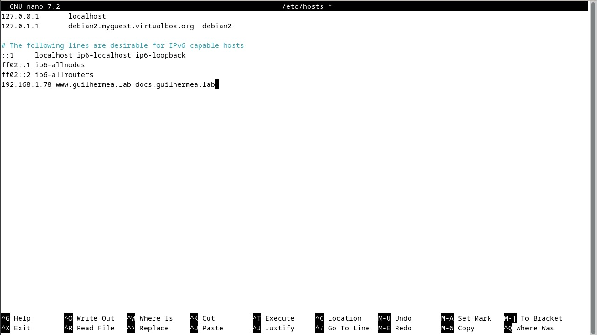
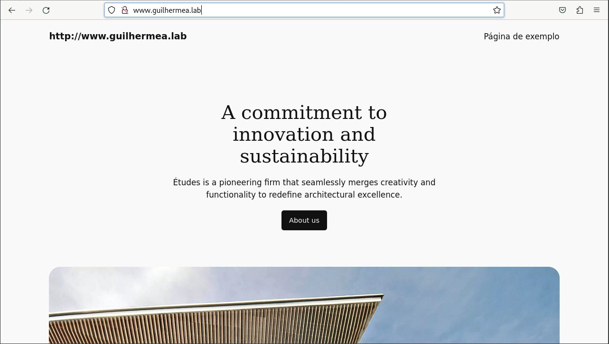
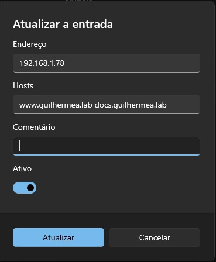

# Configuração do Hosts e Acesso ao WordPress

## Configurando o arquivo hosts

Para acessar o site com URLs personalizadas, adicione os seguintes mapeamentos no arquivo hosts:

```bash
sudo nano /etc/hosts
```

Depois de colocar os hosts, agora dá para acessar o wordpress pelo url correspondente:


Para acessar esse URL no windows, basta alterar o hosts do windows utilizando o powertoys e colocar o ip da máquina linux e o URL correspondente. 

Passo a passo de como acessar o editor de arquivos de hosts do windows utilizando powertoys:

* Baixe o powertoys
* Entre no powertoys e navegue no menu lateral até achar Editor de Arquivos de Hosts
* Clique em Iniciar Editor de Arquivos de Hosts e clique na opção de Nova Entrada
* Coloque o ip da máquina linux e o URL correspondente

