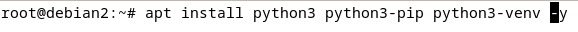
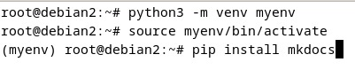
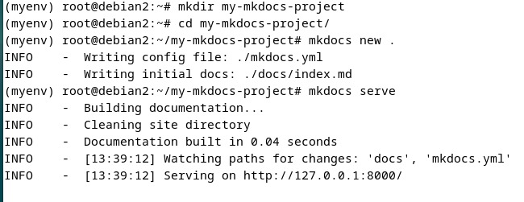
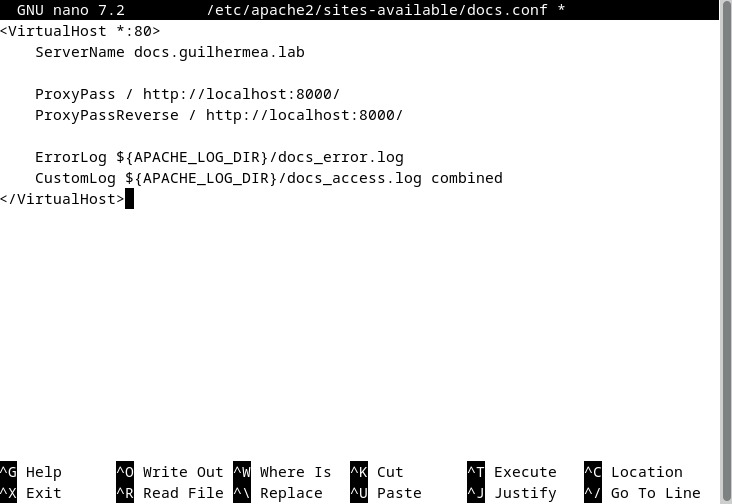
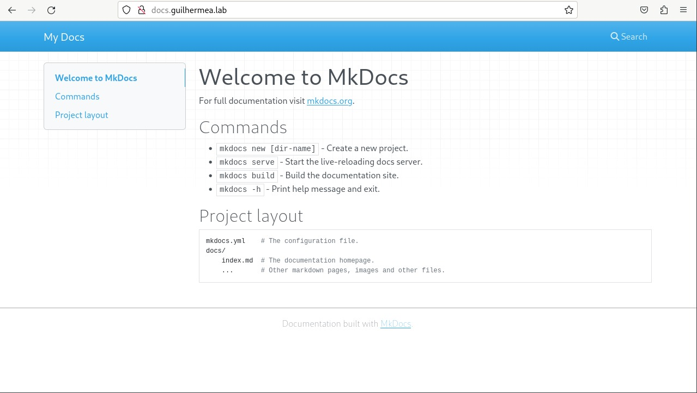

# Configuração do MkDocs

## O que é MkDocs?

*MkDocs* é uma ferramenta de geração de documentação estática projetada para criar sites de documentação a partir de arquivos Markdown. É fácil de configurar e usar, e oferece uma maneira rápida e eficiente de publicar documentação técnica e outros conteúdos estruturados. MkDocs usa o Python como base e fornece uma interface simples para personalizar a aparência do site e adicionar funcionalidades através de temas e plugins.

## Instalando MkDocs e Dependências

Execute os seguintes comandos para instalar MkDocs e suas dependências:

```bash
# Instalar Python, pip e venv
sudo apt install python3 python3-pip -y
sudo apt install python3-venv

# Criar um ambiente virtual Python
python3 -m venv myenv

# Ativar o ambiente virtual
source myenv/bin/activate

# Instalar MkDocs no ambiente virtual
pip install mkdocs
```



Depois de instalar o mkdocs siga esses passos:

* Crie uma nova pasta para o projeto
* Dentro dessa pasta, inicialize um novo projeto MkDocs
* Inicie o servidor MkDocs para visualizar a documentação



Com o MkDocs funcionando, agora tem que colocar a URL correta. Para colocar uma URL personalizada, é preciso criar um arquivo no sites-available do apache.

```bash
sudo nano /etc/apache2/sites-available/docs.conf
```
Dentro desse novo arquivo, colocar a URL personalizada:


Com a nova URL, é so colocar no navegador linux:
